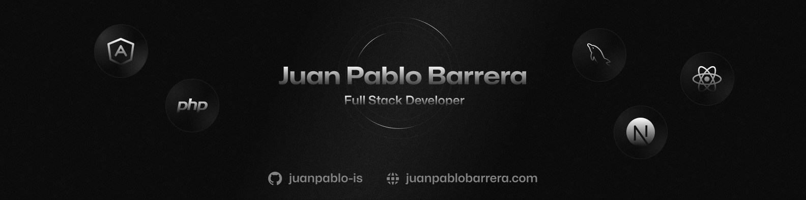

<div align="center">
<a href="#">

</a>
<p></p>
</div>

<div align="center">
    <a href="#" target="_blank">
        Portfolio
    </a>
    <span>&nbsp;❖&nbsp;</span>
    <a href="#-getting-started">
        Getting Started 
    </a>
    <span>&nbsp;❖&nbsp;</span>
    <a href="#%EF%B8%8F-contributing">
        Contributing
    </a>
    <span>&nbsp;❖&nbsp;</span>
    <a href="https://www.linkedin.com/in/juanpablobarrerag/">
        LinkedIn 
    </a>
</div>

</p>

<div align="center">


</div>

## 👋 Introduction

I'm fullstack web developer interested in user experience, performance and creation of digital products.

<div>

<span>&nbsp;</span>

<span>&nbsp;</span>

<span>&nbsp;</span>

<span>&nbsp;</span>

<span>&nbsp;</span>

<span>&nbsp;</span>

<span>&nbsp;</span>

</div>
</p>

## 🚀 Getting Started

To get a local copy up and running, please follow these simple steps:

**Prerequisites**:

- [Node.js +16](https://nodejs.org/en/).
- [Visual Studio Code (recommended)](https://code.visualstudio.com/).

**Recommended extensions** for Visual Studio Code:

- [Astro](https://marketplace.visualstudio.com/items?itemName=astro-build.astro-vscode).
- [Tailwind CSS IntelliSense](https://marketplace.visualstudio.com/items?itemName=bradlc.vscode-tailwindcss).

**Setup development server**:

1. Clone or [fork](https://github.com/JeremyDevCode/template/fork) the repository:

```sh
git@github.com:JeremyDevCode/template.git
```

2. Go to the project folder:

```sh
cd template
```

3. Install dependencies with your favorite package manager:

```sh
# with npm:
npm install

# with yarn:
yarn

# with pnpm:
pnpm install
```

4. Start the development server:

```sh
# with npm:
npm run dev

# with yarn:
yarn dev

# with pnpm:
pnpm dev
```

and open [http://localhost:3000](http://localhost:3000) with your browser to see the result ✨.

## ⚙ Stack

- [**Astro** + Typescript](https://astro.build/) - Build the web
  you want.
- [**React 18**](https://react.dev/) - The library for web and native user interfaces.
- [**Tailwind CSS**](https://tailwindcss.com/) - A utility-first CSS framework for rapidly building custom designs.

## ✌️ Contributing

<a href="https://github.com/JeremyDevCode/template/graphs/contributors">
  
</a>

<p></p>

## 📝 License

- Distributed under the [MIT License](https://github.com/JeremyDevCode/template/blob/main/LICENSE). See `LICENSE` for more information.